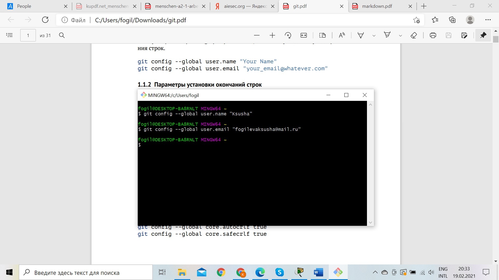
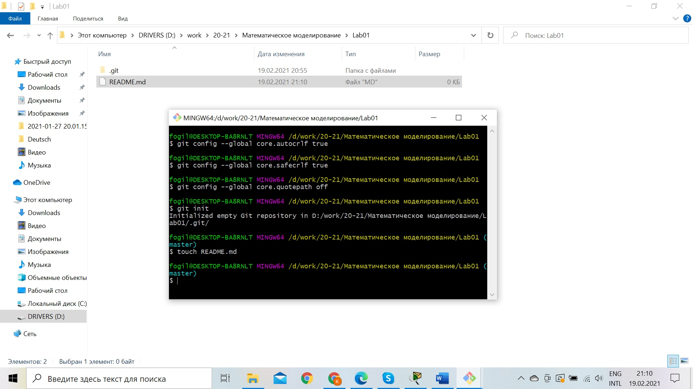

---
## Front matter
lang: ru-RU
title: "Отчёт по лабораторной работе №1"
author: |
	Kseniia Mikhailovna Fogileva\inst{1}
institute: |
	\inst{1}RUDN University, Moscow, Russian Federation

date: 22 February, 2021 Moscow, Russia

## Formatting
toc: false
slide_level: 2
theme: metropolis
header-includes: 
 - \metroset{progressbar=frametitle,sectionpage=progressbar,numbering=fraction}
 - '\makeatletter'
 - '\beamer@ignorenonframefalse'
 - '\makeatother'
aspectratio: 43
section-titles: true
---

# **GitHub**

## Начало работы с git

-Создала профиль и провела необходимые настройки

# **Markdown**

## Я умею:

1. Список
2. Список

-список
-список

**полужирный**, *курсив*, *** и так, и так***.

Ссылка: [link text](https://github.com/FogilevaKseniia)

## {.standout}

Vielen Dank für Ihre Aufmerksamkeit