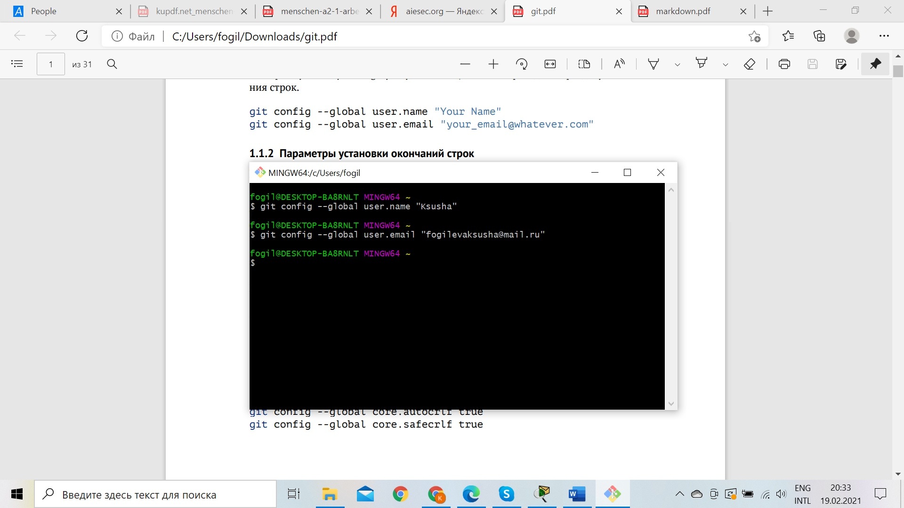
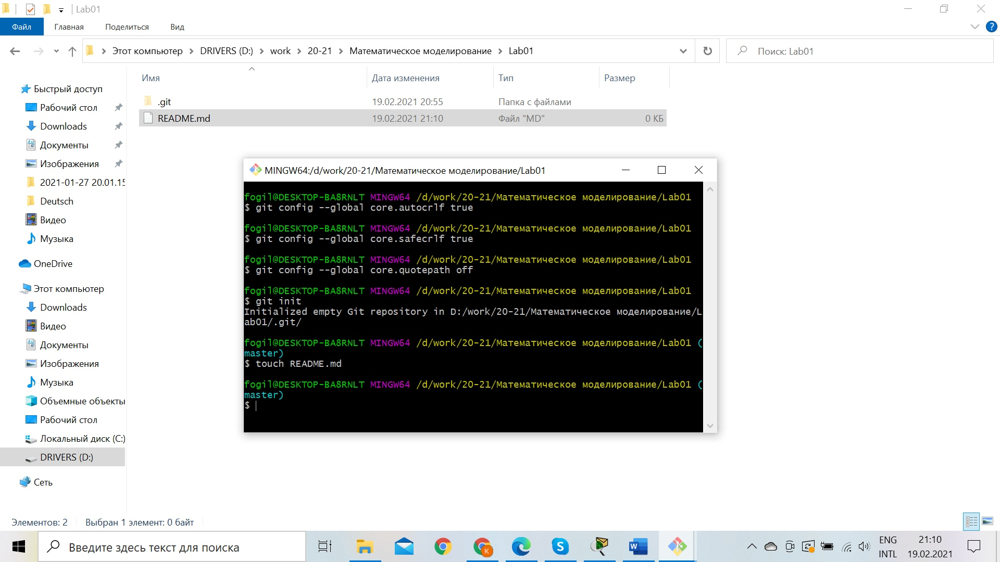
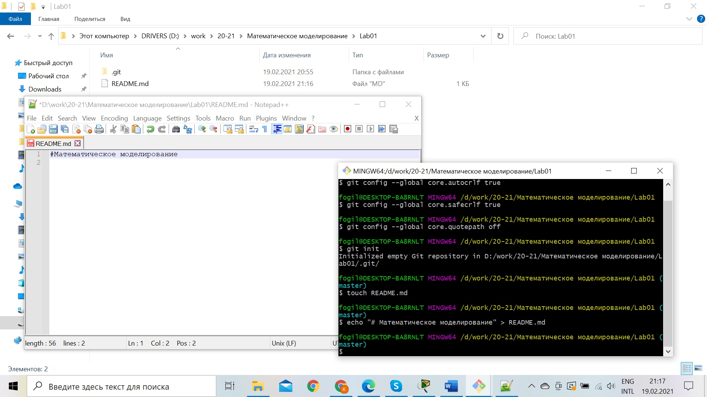
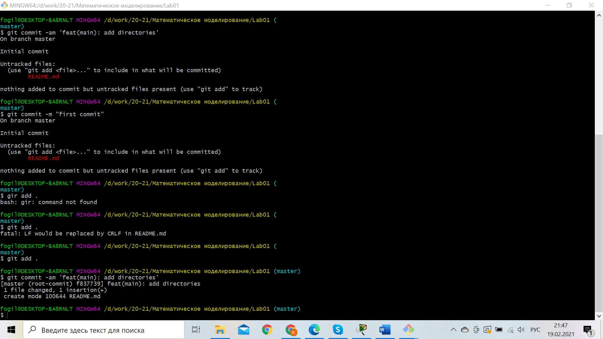
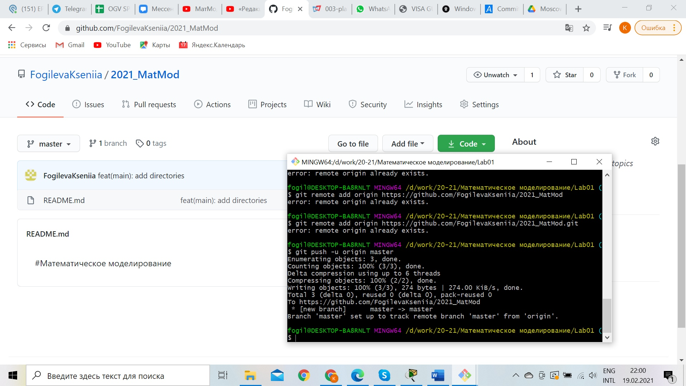
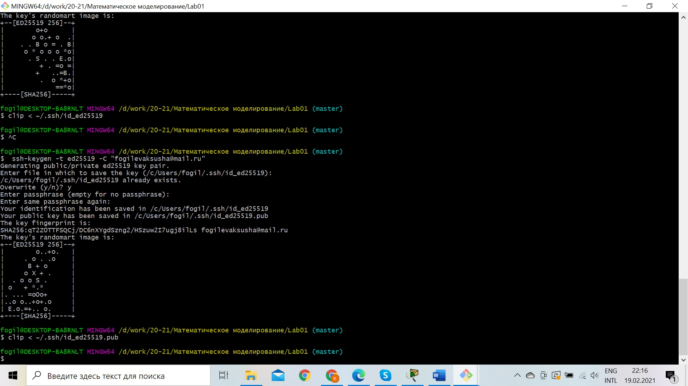
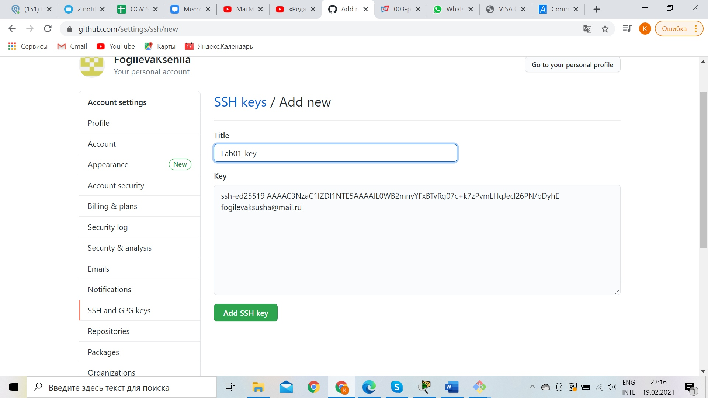

---
# Front matter
lang: ru-RU
title: "Отчёт по лабораторной работе 1"
subtitle: "дисциплина: Математическое моделирование"
author: "Фогилева Ксения Михайловна НПИ-02-18"

# Formatting
toc-title: "Содержание"
toc: true # Table of contents
toc_depth: 2
lof: true # List of figures
lot: true # List of tables
fontsize: 12pt
linestretch: 1.5
papersize: a4paper
documentclass: scrreprt
polyglossia-lang: russian
polyglossia-otherlangs: english
mainfont: PT Serif
romanfont: PT Serif
sansfont: PT Sans
monofont: PT Mono
mainfontoptions: Ligatures=TeX
romanfontoptions: Ligatures=TeX
sansfontoptions: Ligatures=TeX,Scale=MatchLowercase
monofontoptions: Scale=MatchLowercase
indent: true
pdf-engine: lualatex
header-includes:
  - \linepenalty=10 # the penalty added to the badness of each line within a paragraph (no associated penalty node) Increasing the value makes tex try to have fewer lines in the paragraph.
  - \interlinepenalty=0 # value of the penalty (node) added after each line of a paragraph.
  - \hyphenpenalty=50 # the penalty for line breaking at an automatically inserted hyphen
  - \exhyphenpenalty=50 # the penalty for line breaking at an explicit hyphen
  - \binoppenalty=700 # the penalty for breaking a line at a binary operator
  - \relpenalty=500 # the penalty for breaking a line at a relation
  - \clubpenalty=150 # extra penalty for breaking after first line of a paragraph
  - \widowpenalty=150 # extra penalty for breaking before last line of a paragraph
  - \displaywidowpenalty=50 # extra penalty for breaking before last line before a display math
  - \brokenpenalty=100 # extra penalty for page breaking after a hyphenated line
  - \predisplaypenalty=10000 # penalty for breaking before a display
  - \postdisplaypenalty=0 # penalty for breaking after a display
  - \floatingpenalty = 20000 # penalty for splitting an insertion (can only be split footnote in standard LaTeX)
  - \raggedbottom # or \flushbottom
  - \usepackage{float} # keep figures where there are in the text
  - \floatplacement{figure}{H} # keep figures where there are in the text
---

# Цель работы

Познакомиться с GitHub и GitBash, а также познакомиться с языком MarkDown.

# Задание
1. Подготовиться к работе с git
2. Создание репозитория и файла
3. Подгрузить этот файл на git
4. Провести настройки ssh ключа

# Выполнение лабораторной работы

1. Установила имя и электронную почту.(рис. -@fig: 001)

 {#fig: 001 width=70%}

2. Настроила параметры установки окончаний строк, установила отображение Unicod, создала репозиторий git, создала там файл README
(рис. -@fig:002)

 { #fig: 002 width=70%}

3. Запись в файл. (рис. -@fig:003)

 { #fig: 003 width =70%}

4. Загружаем файл в каталог (рис. -@fig:004)

 { #fig: 004 width =70%}

5. Подгружаем репозиторий на git 
(рис. -@fig:005)

{ #fig: 005 width=70%}

6. Создаём ssh ключ 
(рис. -@fig:006)

 { #fig: 006 width=70%}

7. Добавляем ключ на git 
(рис. -@fig:007)

 { #fig: 007 width=70%}

8. Подключение по ключу 
(рис. -@fig:008)

 { #fig: 008 width=70%} 

# Выводы

Познакомилась с GitHub и GitBash, а также познакомилась с языком MarkDown.
