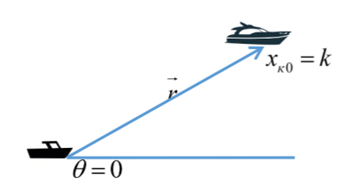
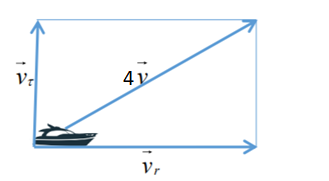
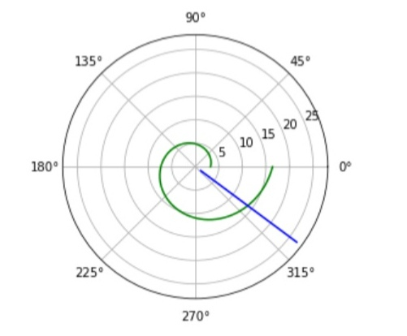
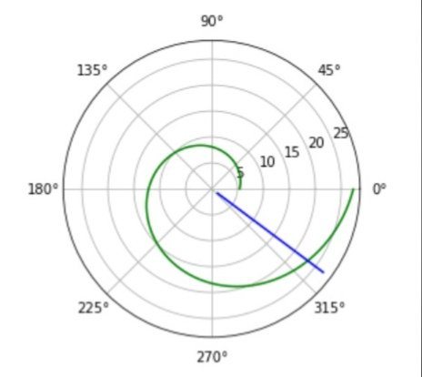

---
## Front matter
lang: ru-RU
title: "Отчёт по лабораторной работе №1"
author: |
	Kseniia Mikhailovna Fogileva\inst{1}
institute: |
	\inst{1}RUDN University, Moscow, Russian Federation

date: 22 February, 2021 Moscow, Russia

## Formatting
toc: false
slide_level: 2
theme: metropolis
header-includes: 
 - \metroset{progressbar=frametitle,sectionpage=progressbar,numbering=fraction}
 - '\makeatletter'
 - '\beamer@ignorenonframefalse'
 - '\makeatother'
aspectratio: 43
section-titles: true
---

# **Задача о погоне**

## Вывести дифференциальное уравнение, описывающее движение катера, с начальными условиями.

Введем полярные координаты. Считаем, что полюс – это точка обнаружения лодки 
браконьеров $x_{Л0} (θ = x_{Л0} = 0)$, а полярная ось $r$ проходит через точку нахождения 
катера береговой охраны. (см. рис. -@fig:001)

{ #fig:001 width=70% }

## Уравнение

Для того, чтобы найти расстояние x (расстояние, после которого катер начнет двигаться 
вокруг полюса), нужно составить простое уравнение. Через время $t$ катер и лодка 
окажутся на одном расстоянии x от полюса. За это время лодка пройдет $x$, а катер $16,2 - x$ (или 
$16,2 + x$, в зависимости от начального положения катера относительно полюса). Время, за которое 
они пройдут это расстояние, можно вычислить как $x \over v$ или $16.2 - x \over 4v$ (во втором 
случае $16,2 + x \over 4v$). Так как время одинаковое, то эти величины одинаковы. Значит
неизвестное расстояние $x$ находится из следующего уравнения:
$$ \frac{x}{v} = \frac{16,2-x}{4v}\ или\ \frac{x}{v} = \frac{16,2+x}{4v}\ $$ 

Тогда $x_{1} = \frac{1}{5}k = 3,24$ (км), а $x_{2} = \frac{1}{3}k = 3,2$ (км), задачу решаем для двух случаев.

# Уравнение

Когда катер береговой охраны окажется на одном расстоянии от полюса, что и лодка, он 
должен сменить прямолинейную траекторию и начать двигаться вокруг полюса удаляясь от него со скоростью 
лодки $v$. Для этого скорость катера раскладывается на две составляющие: $v_{r}$ – радиальная скорость и 
$v_{τ}$ – тангенциальная скорость. (см. рис. -@fig:002)

{ #fig:002 width=70% }

Радиальная скорость – скорость, с которой катер удаляется от полюса, $v_{r} = \frac{\partial r}{\partial t}$. Требуется, 
чтобы эта скорость была равна скорости лодки, поэтому $v_{r} = \frac{\partial r}{\partial t} = v$.

# **Построение траекторий движения катера и лодки**

Написала программу на Phyton, получила вот такие графики для обоих случаев:

{ #fig:003 width=70% }

# { #fig:004 width=70% }

# Также нашли точки пересечения:

В итоге получили, что в случае 1 точка пересечения: $θ = -0.6420926159343304, r = 15.556349186104047$,
а в случае 2: $θ = -0.6420926159343304, r = 25.455844122715714$.

Ссылка: [link text](https://github.com/FogilevaKseniia)

# Выводы

Решила задачу о погоне, построила графики с помощью Python.

## {.standout}

Vielen Dank für Ihre Aufmerksamkeit