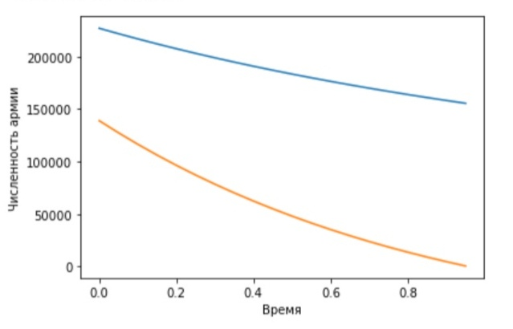
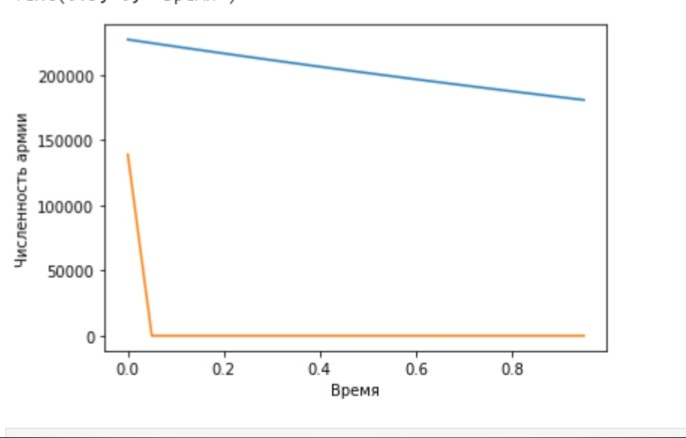

---
## Front matter
lang: ru-RU
title: "Отчёт по лабораторной работе №3"
author: |
	Kseniia Mikhailovna Fogileva\inst{1}
institute: |
	\inst{1}RUDN University, Moscow, Russian Federation

date: 22 February, 2021 Moscow, Russia

## Formatting
toc: false
slide_level: 2
theme: metropolis
header-includes: 
 - \metroset{progressbar=frametitle,sectionpage=progressbar,numbering=fraction}
 - '\makeatletter'
 - '\beamer@ignorenonframefalse'
 - '\makeatother'
aspectratio: 43
section-titles: true
---

# **Модель боевых действий**

**1. Боевые действия между регулярными войсками**

Были изучены начальные условия. Коэффициент смертности, не связанный с боевыми действиями, у первой
армии 0,34, а у второй -- 0,2. Коэффициент эффективности первой и второй армии 0,51 и 
0,87 соответственно.  Функция, описывающая подход подкрепление первой армии, $P(t) = |\sin (t)|+2$, 
подкрепление второй армии описывается функцией $Q(t) = |\cos (t)|$. $x_{0} = 227000$ -- численность
1-ой армии, $y_{0} = 139000$ -- численность 2-ой армии.
Для времени были заданы следующие условия: $t_{0} = 0$ -- начальный момент времени, $t_{max} = 1$ --
предельный момент времени, $dt = 0,05$ -- шаг изменения времени.
Написав программу на Phyton, получили следующий график.

# { #fig:001 width=70% }

# **Боевые действия**

**2. Боевые действия с участием регулярных войск и партизанских отрядов**

Были изучены начальные условия. Коэффициент смертности, не связанный с боевыми действиями, у первой
армии 0,24, а у второй -- 0,18. Коэффициент эффективности первой и второй армии 0,28 и 
0,75 соответственно.  Функция, описывающая подход подкрепление первой армии, $P(t) = |\sin (8t)|+1$, 
подкрепление второй армии описывается функцией $Q(t) = 2|\cos (t)|$. Изначальная численность армий 
такая же, как и в предыдущем пункте.
Условия для времени были оставлены такие же, как и в п. 1.3, соответственно, не дублировали их в 
программе.

# { #fig:002 width=70% }

# Выводы

Была построена упрощенная модель боевых действий с помощью Python.

В боевых действиях между регулярными войсками армия X одержала победу, но для этого это понадобилось довольно 
много времени (как показано на графике, численность армии Y будет на исходе практический в предельный 
момент времени).

В боевых действиях с участием регулярных войск и партизанских отрядов также одержит победу армия Х, однако
намного быстрее, чем в 1-ом случае (по графику видно, что армия Y потеряла всех бойцов практически
сразу после начала войны).

## {.standout}

Vielen Dank für Ihre Aufmerksamkeit