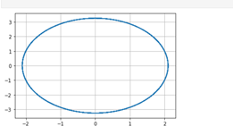
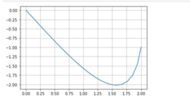
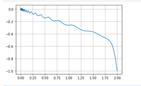

---
## Front matter
lang: ru-RU
title: "Отчёт по лабораторной работе №4"
author: |
	Kseniia Mikhailovna Fogileva\inst{1}
institute: |
	\inst{1}RUDN University, Moscow, Russian Federation

date: 22 February, 2021 Moscow, Russia

## Formatting
toc: false
slide_level: 2
theme: metropolis
header-includes: 
 - \metroset{progressbar=frametitle,sectionpage=progressbar,numbering=fraction}
 - '\makeatletter'
 - '\beamer@ignorenonframefalse'
 - '\makeatother'
aspectratio: 43
section-titles: true
---

# **Модель гармонических колебаний**

**1. Колебания без затуханий и без действий внешней силы**

Уравнение свободных колебаний гармонического осциллятора имеет следующий вид:
$$ \ddot {x} + 2 \gamma \dot {x} + \omega _0^2x = f(t) $$

Изучили начальные условия. Это уравнение консервативного осциллятора, энергия колебания которого сохраняется во времени. Т. е. потери в системе 
отсутствуют, это означает,что $\gamma = 0$. Собственная частота колебаний $\omega = 2,4$. $x_{0} = 2, y_{0} = -1$. Правая часть уравнения $f(t) = 0$.
Ищем решение на интервале $t \in [0; 60]$ (шаг 0,05), значит, $t_{0} = 0$ -- начальный момент времени, $t_{max} = 60$ -- предельный момент времени, 
$dt = 0,05$ -- шаг изменения времени.

# { #fig:001 width=70% }

# **2. Колебания c затуханием и без действий внешней силы**

Изучили начальные условия. Потери энергии в системе $\gamma = 7$. Собственная частота колебаний $\omega = 9$. $x_{0}$ и $y_{0}$ те же, что и в п. 1.1. 
Правая часть уравнения такая же, как и в п. 1.1.

# { #fig:002 width=70% }

# **3. Колебания c затуханием и под действием внешней силы**

Изучили начальные условия. Потери энергии в системе $\gamma = 12$. Собственная частота колебаний $\omega = 3$. $x_{0}$ и $y_{0}$ те же, что и в п. 1.1. 
Правая часть уравнения $f(t) = 0,2 \sin (5t)$.

# { #fig:003 width=70% }

# Выводы

Была построена модель гармонических колебаний с помощью Python.