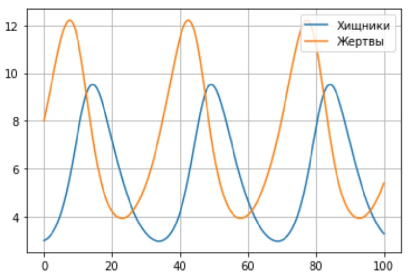
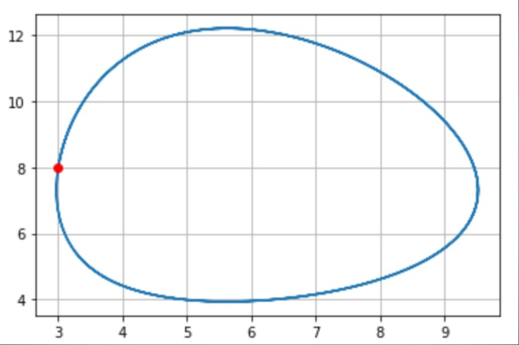

---
## Front matter
lang: ru-RU
title: "Отчёт по лабораторной работе №5"
author: |
	Kseniia Mikhailovna Fogileva\inst{1}
institute: |
	\inst{1}RUDN University, Moscow, Russian Federation

date: 22 February, 2021 Moscow, Russia

## Formatting
toc: false
slide_level: 2
theme: metropolis
header-includes: 
 - \metroset{progressbar=frametitle,sectionpage=progressbar,numbering=fraction}
 - '\makeatletter'
 - '\beamer@ignorenonframefalse'
 - '\makeatother'
aspectratio: 43
section-titles: true
---

# **Модель гармонических колебаний**
Цель работы: С помощью Python построить модель Лотки-Вольтерры типа "хищник -- жертва".

# **Модель**
1. Для этой модели считаем, что $x$ -- число жертв, а $y$ -- число хищников. Коэффициент 0,19 описывает скорость естественного 
прироста числа жертв в отсутствие хищников, 0,18 -- естественное вымирание хищников, лишенных пищи в виде жертв. Вероятность взаимодействия жертвы и хищника 
считается пропорциональной как количеству жертв, так и числу самих хищников $(xy)$. Каждый акт взаимодействия уменьшает популяцию жертв, однако способствует 
увеличению популяции хищников (коэффициенты 0,026 и 0,032). Стационарное состояние в точке: $x_0 = 3, y_0 = 8$.
2. Для колебаний изменения числа популяции хищников и жертв ищем на интервале $t \in [0; 100]$ (шаг 0,1), значит, $t_{0} = 0$ -- начальный момент 
времени, $t_{max} = 37$ -- предельный момент времени, $dt = 0,05$ -- шаг изменения времени.

# **Графики**
Получились графики колебаний изменения числа популяции хищников и жертв (см. рис. -@fig:001), ещё также график зависимости изменения численности хищников 
от изменения численности жертв (см. рис. -@fig:002).

# { #fig:003 width=70% }

# { #fig:001 width=70% }

# Выводы

С помощью Python построили модель Лотки-Вольтерры типа "хищник -- жертва".