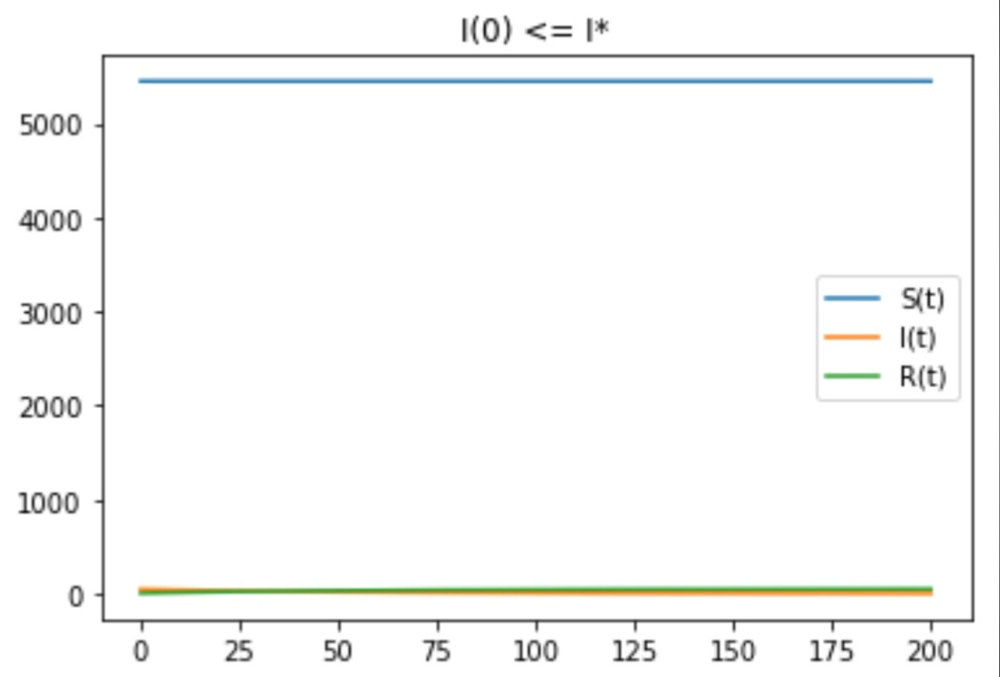
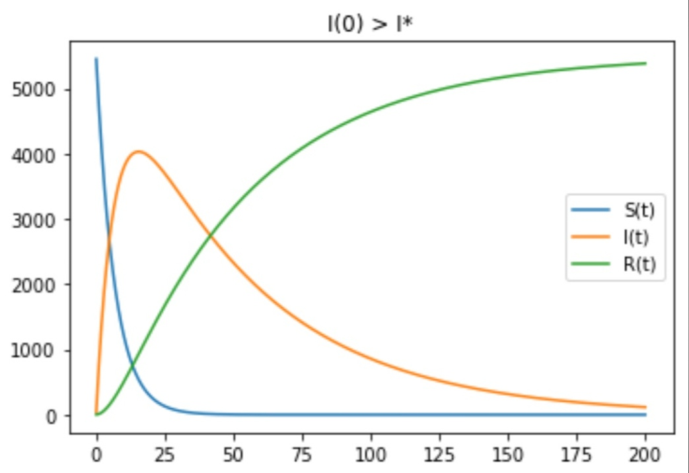

---
## Front matter
lang: ru-RU
title: "Отчёт по лабораторной работе №6"
author: |
	Kseniia Mikhailovna Fogileva\inst{1}
institute: |
	\inst{1}RUDN University, Moscow, Russian Federation

date: 23 March, 2021 Moscow, Russia

## Formatting
toc: false
slide_level: 2
theme: metropolis
header-includes: 
 - \metroset{progressbar=frametitle,sectionpage=progressbar,numbering=fraction}
 - '\makeatletter'
 - '\beamer@ignorenonframefalse'
 - '\makeatother'
aspectratio: 43
section-titles: true
---

# **Простейшая модель эпидемии**
Цель работы: Построить простейшую модель эпидемии с помощью Python.

# **Модель**
Предположим, что некая популяция, состоящая из N особей, (считаем, что популяция изолирована) подразделяется на три группы:

- $S(t)$ — восприимчивые к болезни, но пока здоровые особи;

- $I(t)$ — это число инфицированных особей, которые также при этом являются распространителями инфекции;

- $R(t)$ — это здоровые особи с иммунитетом к болезни. 

До того, как число заболевших не превышает критического значения $I^*$ считаем, что все больные изолированы и не заражают здоровых. Когда $I(t) > I^*$, тогда 
инфицирование способны заражать восприимчивых к болезни особей.
Cкорость изменения числа S(t) меняется по закону:
$$ \frac{\partial S}{\partial t} = \begin{cases} - \alpha S, если I(t)>I^* \\ 0, если I(t) \leq I^* \end{cases}$$

# **Модель**
Поскольку каждая восприимчивая к болезни особь, которая в конце концов заболевает, сама становится инфекционной, то скорость изменения числа инфекционных 
особей представляет разность за единицу времени между заразившимися и теми, кто уже болеет и лечится, т.е.:

$$ \frac{\partial I}{\partial t} = \begin{cases} - \alpha S - \beta I, если I(t)>I^* \\ - \beta I, если I(t) \leq I^* \end{cases}$$

А скорость изменения выздоравливающих особей (при этом приобретающие иммунитет к болезни):

$$ \frac{\partial R}{\partial t} = \beta I$$

# ** Модель**
Постоянные пропорциональности:
- $\alpha$ — коэффициент заболеваемости

- $\beta$ — коэффициент выздоровления

Для того, чтобы решения соответствующих уравнений определялись однозначно, нужно задать начальные условия. Считаем, что на начало эпидемии в момент 
времени $t = 0$ нет особей с иммунитетом к болезни $R(0) = 0$, а число инфицированных и восприимчивых к болезни особей $I(0)$ и $S(0)$ соответственно. 
Для анализа картины протекания эпидемии необходимо рассмотреть два случая: $I(0) \leq I^*$ и $I(0) > I^*$.

# **Графики**

# { #fig:003 width=70% }

# { #fig:001 width=70% }

# Выводы

Построили простейшую модель эпидемии с помощью Python.

В обоих случаях люди острова смогут победить болезнь.