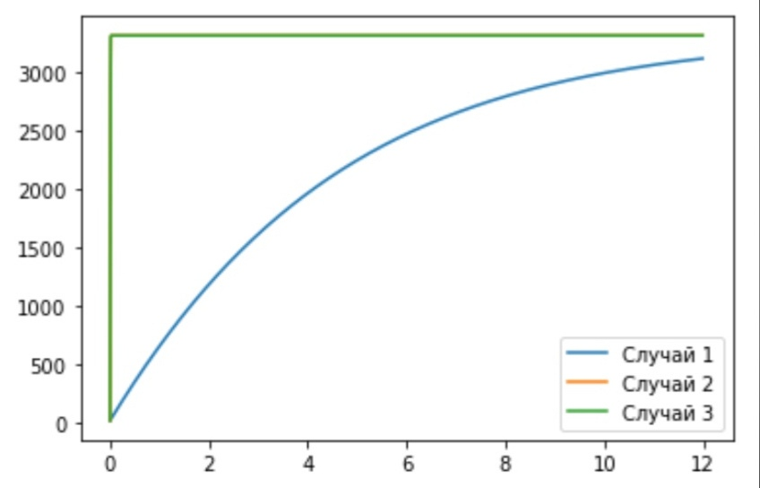
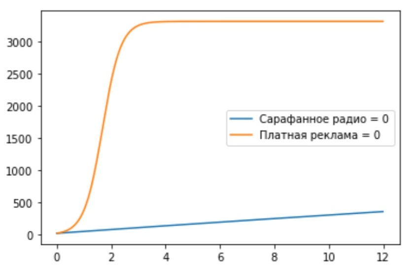

---
## Front matter
lang: ru-RU
title: "Отчёт по лабораторной работе №7"
author: |
	Kseniia Mikhailovna Fogileva\inst{1}
institute: |
	\inst{1}RUDN University, Moscow, Russian Federation

date: 23 March, 2021 Moscow, Russia

## Formatting
toc: false
slide_level: 2
theme: metropolis
header-includes: 
 - \metroset{progressbar=frametitle,sectionpage=progressbar,numbering=fraction}
 - '\makeatletter'
 - '\beamer@ignorenonframefalse'
 - '\makeatother'
aspectratio: 43
section-titles: true
---

# **Рекламная модель**
Построить модель рекламной кампании с помощью Python.

# **Модель**
Постройте график распространения рекламы, математическая модель которой описывается следующим уравнением:

$\frac{\partial n}{\partial t} = (0.211 + 0.000011n(t))(N - n(t))$
$\frac{\partial n}{\partial t} = (0.0000311 + 0.21n(t))(N - n(t))$
$\frac{\partial n}{\partial t} = (0.511sin(t) + 0.311cos(t)n(t))(N - n(t))$
При этом объем аудитории $N$ = 3310, в начальный момент о товаре знает 22 человека. 
Для случая 2 определите в какой момент времени скорость распространения рекламы будет иметь максимальное значение.

# **Модель**
Модель рекламной кампании описывается следующими величинами. Считаем, что

$\frac{\partial n}{\partial t}$ — скорость изменения со временем числа потребителей, узнавших о товаре и готовых его купить;

$t$ — время, прошедшее с начала рекламной кампании;

$n(t)$ — число уже информированных клиентов. Эта величина пропорциональна числу покупателей, еще не знающих о нем. 
Это описывается следующим образом:

$$ \alpha_1(t)(N-n(t)) $$

$N$ — общее число потенциальных платежеспособных покупателей

$\alpha_1(t)>0$ — характеризует интенсивность рекламной кампании (зависит от затрат на рекламу в данный момент времени).

Помимо этого, узнавшие о товаре потребители также распространяют полученную информацию среди потенциальных 
покупателей, не знающих о нем (в этом случае работает т.н. сарафанное радио). Этот вклад в рекламу описывается величиной

$$ \alpha_2(t)n(t)(N-n(t)) $$

эта величина увеличивается с увеличением потребителей узнавших о товаре.

# ** Модель**
Математическая модель распространения рекламы описывается уравнением:

$$ \frac{\partial n}{\partial t} = (\alpha_1(t) + \alpha_2(t)n(t))(N - n(t))$$

# **Графики**

# { #fig:003 width=70% }

# { #fig:001 width=70% }

# Выводы

Построила модель рекламной кампании с помощью Python.

Выяснила, что рекламная кампания для случая, когда $\alpha_1(t) < \alpha_2(t)$ (2 случай), эффективнее, чем кампания для случая, когда $\alpha_1(t) > \alpha_2(t)$ (1 случай).

Определила, что в момент времени $t = 0,01$ эффективность рекламы будет иметь максимально быстрый рост.

Выяснила, что реклама только путем "сарафанного радио" эффективнее только платной рекламы.